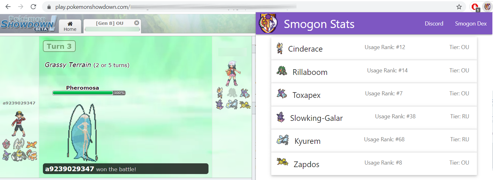
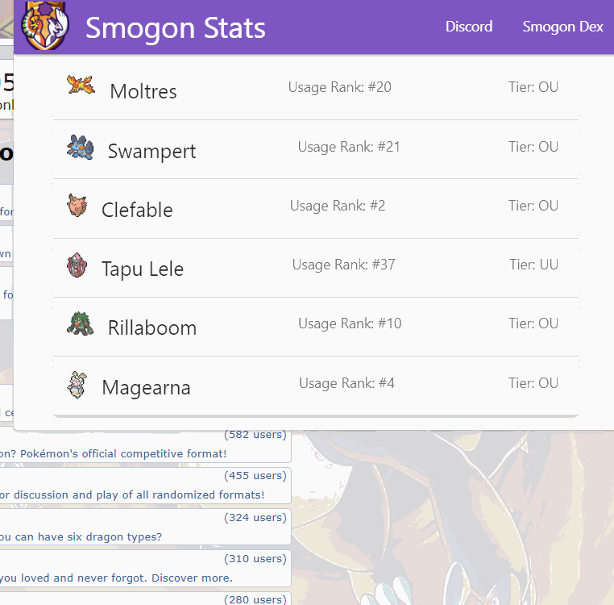

# Smogon Stats - Chrome Extension 
[](https://discord.com/invite/BM7ZRNB)

[Join Smogon Stats Support Server](https://discord.com/invite/BM7ZRNB) to try out the bot and talk to the devs!

## Overview
Chrome Extension to help Pokemon Showdown players with Smogon usage statistics.

It automatically gets opponent's team and display usage data from PokemonShowdown.

### Get it on Chrome Store:
[](https://chrome.google.com/webstore/detail/smogon-stats/fcgfhfnffkjocaebpeakjojffnccglfp)

### Explore oppoments team usage stats


## Features
* Pending...

## Development

### Requirements

* Node.js 18.20 or newer
* npm
* Google Chrome or another Chromium-based browser for loading the unpacked extension

### Install

```bash
npm install
```

### Build

```bash
npm run build
```

Builds the extension into the `build/` folder using the shared webpack configuration in development mode.

### Watch

```bash
npm run build:watch
```

Rebuilds the extension bundle when files change.

### Production Build

```bash
npm run build:prod
```

For compatibility with earlier automation, `npm run build-release` remains available and delegates to the production build.

### Type Check

```bash
npm run typecheck
```

Runs the TypeScript compiler without emitting files.

### Load The Extension

1. Open `chrome://extensions`.
2. Enable Developer mode.
3. Choose Load unpacked.
4. Select the repository root folder.

The manifest points at the generated files under `build/`, so rebuild after source changes before reloading the extension.

